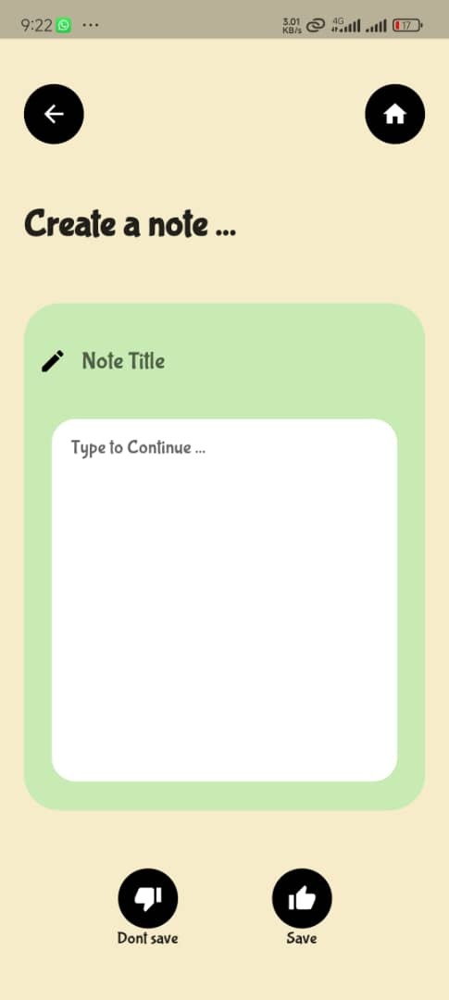

# Flutter Notes, Calculator, and Scheduler App

A versatile Flutter mobile application that allows users to take notes, use a calculator, and schedule events with notification alerts. All data is stored locally in a SQLite database.

## Features

- **Note-Taking:**
  - Create, read, update, and delete notes.
  - Store notes locally using SQLite.
  - Simple and intuitive user interface for managing notes.

- **Calculator:**
  - Perform basic arithmetic operations.
  - User-friendly interface for quick calculations.

- **Scheduler:**
  - Schedule events and set reminders.
  - Receive notifications when scheduled events are due.
  - View and manage upcoming events.

## Screenshots




## Installation

To get the app running on your local machine, follow these steps:

1. **Clone the Repository:**
   ```sh
   git clone <repository-url>
   cd <repository-directory>
